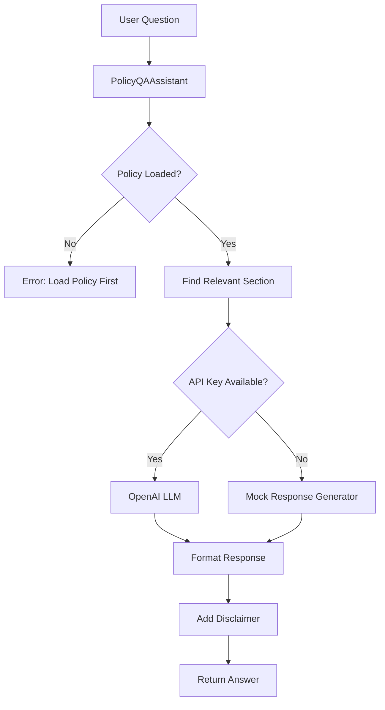

# Policy Document Q&A Assistant

**Assisto Company Assessment - January 2026**

A safe, compliant insurance policy explanation system that helps users understand policy clauses in simple, easy-to-understand language without providing legal advice.

---

## 📋 Problem Statement

Insurance policies are often written in complex legal language that is difficult for average customers to understand. This creates several challenges:

- **Confusion**: Customers don't understand what is covered and what isn't
- **Missed Coverage**: Important policy details are overlooked
- **Poor Decisions**: Customers can't make informed choices about their insurance
- **Support Burden**: High volume of basic questions to customer service

**The Solution**: An AI-powered assistant that explains policy clauses in simple English, uses practical examples, and maintains strict safety boundaries to avoid providing legal advice.

---

## 🎯 Solution Overview

The Policy Document Q&A Assistant is a Python-based application that:

1. **Accepts** insurance policy documents as text input
2. **Processes** user questions in natural language
3. **Identifies** the most relevant sections of the policy
4. **Explains** answers in simple, non-technical language
5. **Provides** practical examples for clarity
6. **Maintains** safety by never giving legal advice
7. **Includes** mandatory disclaimers on all responses

### Key Features

✅ **Safe & Compliant**: Never provides legal or financial advice  
✅ **Clear Communication**: Explains complex terms in simple English  
✅ **Practical Examples**: Uses relatable scenarios to aid understanding  
✅ **Honest Responses**: Clearly states when information is unavailable or ambiguous  
✅ **Flexible Integration**: Works with or without LLM API (mock mode for testing)  
✅ **Clean Architecture**: Separates prompts from application logic  

---

## 🏗️ Architecture

### Project Structure

```
policy-qa-assistant/
│
├── app.py                      # Main application logic
├── prompts/
│   └── policy_qa_prompt.txt    # LLM prompt template
├── data/
│   └── sample_policy.txt       # Sample insurance policy
├── requirements.txt            # Python dependencies
└── README.md                   # This file
```

### Component Design



### Data Flow

1. **Input**: User provides a question about the policy
2. **Validation**: System checks question length and policy availability
3. **Section Matching**: Keyword-based algorithm finds relevant policy sections
4. **Response Generation**: 
   - **With API Key**: Calls OpenAI GPT-3.5-turbo with carefully crafted prompt
   - **Without API Key**: Uses pre-defined mock responses for common questions
5. **Safety Layer**: Ensures disclaimer is always included
6. **Output**: Returns formatted answer with examples and disclaimer

### Safety Constraints

The system implements multiple safety layers:

- ✅ **Input Validation**: Limits question length (max 500 characters)
- ✅ **No Hallucination**: Only references information in the policy document
- ✅ **Ambiguity Acknowledgment**: Clearly states when policy terms are unclear
- ✅ **Mandatory Disclaimer**: Every response ends with "This is not legal advice."
- ✅ **Prompt Engineering**: LLM instructions explicitly prohibit legal advice
- ✅ **Graceful Degradation**: Falls back to mock mode if API fails

---

## 🚀 How to Run

### Prerequisites

- Python 3.8 or higher
- (Optional) Google Gemini API key for real LLM integration

### Installation

1. **Clone or navigate to the project directory**:
   ```bash
   cd policy-qa-assistant
   ```

2. **Install dependencies**:
   ```bash
   pip install -r requirements.txt
   ```

### Running the Application

#### Option 1: Mock Mode (No API Key Required)

Perfect for testing and demonstration:

```bash
python app.py
```

The application will automatically detect that no API key is available and use mock responses.

### Option 2: With Google Gemini API (Real LLM)

For production use with actual LLM:

1. **Set your Google Gemini API key**:
   
   **Windows (PowerShell)**:
   ```powershell
   $env:GEMINI_API_KEY="your-api-key-here"
   ```
   
   **Windows (Command Prompt)**:
   ```cmd
   set GEMINI_API_KEY=your-api-key-here
   ```
   
   **Linux/Mac**:
   ```bash
   export GEMINI_API_KEY="your-api-key-here"
   ```

2. **Run the application**:
   ```bash
   python app.py
   ```

### Using as a Library

You can also import and use the `PolicyQAAssistant` class in your own code:

```python
from app import PolicyQAAssistant

# Initialize with a policy file
assistant = PolicyQAAssistant("data/sample_policy.txt")

# Ask a question
answer = assistant.ask_question("What does negligence mean?")
print(answer)

# Or set policy text directly
assistant.set_policy_text("Your policy text here...")
answer = assistant.ask_question("What is covered?")
```

---

## 💡 Example Usage

### Example 1: Understanding Negligence

**Question**: "What does negligence mean?"

**Answer**:
```
Negligence means failing to take proper care to avoid causing harm or damage. 
In simple terms, it's when someone is careless or doesn't do what a reasonable 
person would do to prevent problems.

For example, if you know your roof is leaking but don't fix it for months, and 
water damage gets worse, that could be considered negligence. The insurance may 
not cover the additional damage because you didn't take reasonable steps to 
prevent it.

Another example: leaving your doors and windows unlocked when you go on vacation, 
and then experiencing a theft. This might be seen as negligent because you didn't 
take basic security precautions.

This is not legal advice.
```

### Example 2: Understanding Deductibles

**Question**: "How does the deductible work?"

**Answer**:
```
A deductible is the amount of money you have to pay out of your own pocket 
before the insurance company starts paying for a covered claim.

For example, if your policy has a $1,000 deductible and you have $5,000 in 
covered damage:
- You pay the first $1,000
- The insurance company pays the remaining $4,000

Think of it like a threshold - you handle smaller costs yourself, and insurance 
kicks in for larger expenses. Generally, policies with higher deductibles have 
lower monthly premiums, and vice versa.

This is not legal advice.
```

### Example 3: Filing a Claim

**Question**: "How do I file a claim?"

**Answer**:
```
To file a claim, you need to follow these steps:

1. Report the damage within 48 hours of discovering it
2. Call the claims department at 1-800-CLAIMS-1
3. Have your policy number ready
4. Take photos of the damage if possible
5. Don't throw away damaged items until they've been inspected

For example, if you come home and find your house was broken into, you should:
- Call the police first
- Take photos of the damage
- Make a list of stolen items
- Call the insurance claims line within 48 hours
- Keep all receipts and documentation

The insurance company will investigate and, if approved, settle the claim 
within 30 days.

This is not legal advice.
```

---

## 🔒 Safety Features

This system is designed with multiple safety layers to ensure compliance and avoid legal liability:

### 1. **No Legal Advice**
- Every response includes the disclaimer: "This is not legal advice."
- Prompt engineering explicitly instructs the LLM to avoid legal advice
- System only explains policy content, never advises on legal matters

### 2. **No Hallucination**
- Responses are grounded in the actual policy document
- System acknowledges when information is not in the policy
- Uses keyword matching to find relevant sections before generating responses

### 3. **Ambiguity Acknowledgment**
- When policy language is unclear, the system says so explicitly
- Avoids making assumptions or interpretations
- Encourages users to contact the insurance company for clarification

### 4. **Input Validation**
- Question length limited to 500 characters
- Validates that policy is loaded before answering
- Handles errors gracefully with clear messages

### 5. **Professional Tone**
- Calm, helpful, and professional communication
- Avoids alarmist or overly casual language
- Maintains appropriate boundaries

---

## 🛠️ Technical Details

### Technologies Used

- **Language**: Python 3.8+
- **LLM Integration**: Google Gemini API (optional)
- **Architecture**: Object-oriented design with clean separation of concerns
- **Error Handling**: Graceful degradation with mock fallback

### Code Quality

- ✅ **Readable**: Clear variable names, comprehensive comments
- ✅ **Modular**: Separated concerns (prompts, data, logic)
- ✅ **Documented**: Docstrings for all classes and methods
- ✅ **Maintainable**: Simple structure, easy to extend
- ✅ **Testable**: Mock mode allows testing without API costs

### Prompt Engineering

The prompt template (`prompts/policy_qa_prompt.txt`) is carefully designed to:

- Set clear role boundaries for the LLM
- Emphasize simple language and examples
- Prohibit legal advice explicitly
- Mandate disclaimer inclusion
- Handle ambiguity appropriately

---

## 🔮 Future Enhancements

Potential improvements for production deployment:

1. **Multi-Document Support**: Handle multiple policy documents simultaneously
2. **Advanced Search**: Use vector embeddings for better section matching
3. **Web Interface**: Build a user-friendly web UI with Flask/FastAPI
4. **Conversation History**: Track multi-turn conversations for context
5. **Analytics**: Log common questions to improve policy clarity
6. **Multi-Language**: Support policy explanations in multiple languages
7. **PDF Support**: Direct PDF upload and parsing
8. **Comparison Tool**: Compare coverage across different policies
9. **Citation System**: Link answers to specific policy sections
10. **Admin Dashboard**: Manage policies and monitor usage

---

## ⚠️ Disclaimer

**IMPORTANT LEGAL NOTICE**

This Policy Document Q&A Assistant is an educational tool designed to help users understand insurance policy language. It is NOT a substitute for professional legal or financial advice.

- ✋ **Not Legal Advice**: Responses from this system do not constitute legal advice
- ✋ **Not Financial Advice**: This tool does not provide financial planning guidance
- ✋ **Informational Only**: All explanations are for informational purposes only
- ✋ **Verify Information**: Always verify important information with your insurance provider
- ✋ **Consult Professionals**: For legal or financial decisions, consult qualified professionals

**By using this system, you acknowledge that:**
- You understand this is an AI-powered explanation tool
- You will not rely on it for legal or financial decisions
- You will consult appropriate professionals for advice
- The developers and Assisto Company are not liable for any decisions made based on this tool's output

---

## 📞 Support & Contact

For questions about this assessment project:

**Candidate**: Applicant for Assisto Company  
**Assessment Date**: January 2026  
**Project**: Policy Document Q&A Assistant  

---

## 📄 License

This project is created as part of the Assisto Company assessment process.

---

**Built with ❤️ for Assisto Company Assessment**
